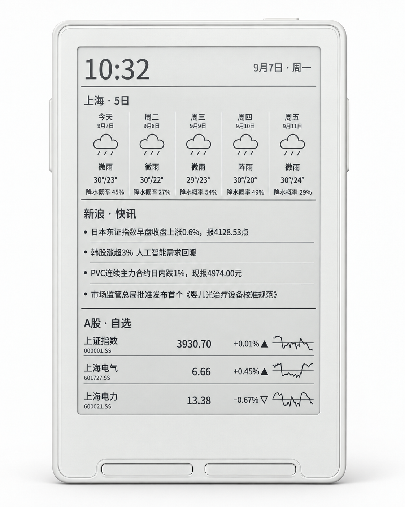
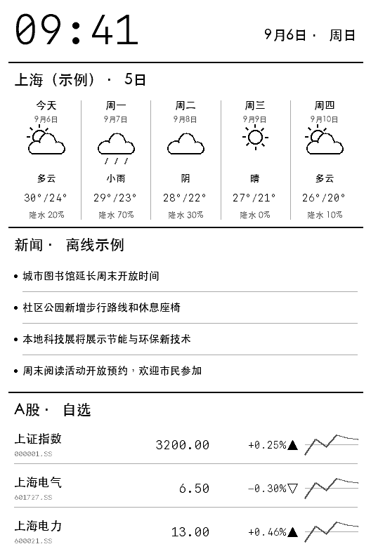
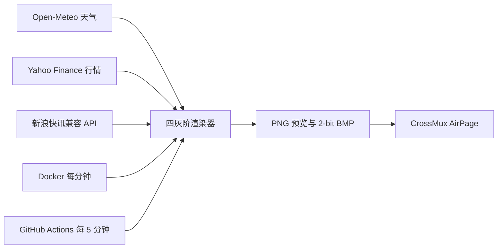

# CrossMux AirPage

面向阅星瞳 X3 / CrossMux AirPage 的四灰阶信息板。它在原生 `528×792`
画布上显示时间与日期、上海 5 日天气、4 条新浪 7×24 快讯，以及上证指数和
两只 A 股自选股，并生成固件可直接接收的 2-bit BMP。

本项目只有定时渲染与推送进程，不提供 Web 页面，也不开放 HTTP 端口。

## 效果预览

<p align="center">
  
</p>

上图是经过美化的外观展示图，不用于证明实时行情或设备刷新结果。
以下是程序直接生成的 `528×792` 离线示例，数据为虚构样例：

<p align="center">
  
</p>

## 数据流



Docker 和 GitHub Actions 是两种独立运行方式。请只启用一种，避免设备被重复
刷新。当前默认方案是 Docker 每分钟推送；GitHub 定时推送默认关闭。

## Docker 运行

要求 Docker Engine 和 Docker Compose：

```bash
cp .env.example .env
# 在 .env 中填写 AIRPAGE_DEVICE_URL
chmod 600 .env
docker compose up -d --build
```

容器启动后会立即运行一次，之后按照 `AIRPAGE_PUSH_INTERVAL_MINUTES` 周期执行。
生成的 `airpage.png` 和 `airpage.bmp` 保存在 Docker volume 的 `/data`。
同一目录还保存 `cache.json`（已校验的数据缓存）和 `status.json`（运行状态）。
容器重启会恢复有效缓存；修改天气坐标、股票代码或新闻源后，对应旧缓存会自动失效。

常用命令：

```bash
docker compose ps
docker compose logs -f airpage
docker compose up -d --build --force-recreate
docker compose down
```

查看调度状态或验证最近一次上传：

```bash
docker compose exec -T airpage python -m app.healthcheck
docker compose exec -T airpage python -m app.healthcheck --require-upload
docker compose exec -T airpage python -c "from pathlib import Path; print(Path('/data/status.json').read_text())"
```

健康检查要求任务和渲染近期完成，容许时间随执行周期调整；旧 BMP 存在不再等于健康。
外部数据源或上传接口暂时失败会记录为 `degraded`，不直接当成进程停止。
状态文件分别保存最近任务开始/完成、渲染、上传、刷新通知时间和连续失败次数。
`--require-upload` 额外要求最近一轮上传成功，用于部署验证。

## GitHub Actions 运行

`.github/workflows/push-airpage.yml` 支持手动运行，也可以在每小时的
`02、07、12……57` 分执行，即约每 5 分钟一次。GitHub 定时任务可能因平台负载
延迟，不是硬实时调度。

启用定时推送需要：

1. 创建 Repository secret `AIRPAGE_DEVICE_URL`。
2. 如需新闻，创建 Repository secret `NEWS_API_BASE_URL`。
3. 创建 Repository variable `AIRPAGE_PUSH_ENABLED=true`。
4. 停止 Docker 推送，避免两套任务同时刷新设备。

天气和行情配置可按下表创建为 Repository variables；未填写时使用项目默认值。
新闻 API 地址始终作为 secret 管理，不应写入代码、文档或普通 variable。
如果曾在 GitHub 界面禁用整个工作流，还需先重新启用它；仅更改 variable 不会解除禁用。
托管 runner 每轮都是新环境，本项目不通过 Actions 缓存或 artifact 保存新闻与状态文件，
因此无法像 Docker 数据卷一样继承上一轮失败回退缓存。

## 环境变量

| 变量 | 默认值 | 用途 |
|---|---:|---|
| `TZ` | `Asia/Shanghai` | 看板时区 |
| `OUTPUT_DIR` | `data` | PNG/BMP 输出目录 |
| `AIRPAGE_WIDTH` / `AIRPAGE_HEIGHT` | `528` / `792` | X3 原生画布尺寸 |
| `WEATHER_LOCATION` | `上海` | 天气标题 |
| `WEATHER_LATITUDE` / `WEATHER_LONGITUDE` | `31.2304` / `121.4737` | Open-Meteo 查询坐标 |
| `WEATHER_TIMEZONE` | `Asia/Shanghai` | 天气时区 |
| `WEATHER_FORECAST_DAYS` | `5` | 显示当天起 1–5 天预报 |
| `WEATHER_REFRESH_SECONDS` | `1800` | 天气重新采集间隔；本地天气日期跨天时额外采集 |
| `WEATHER_MAX_AGE_SECONDS` | `21600` | 天气缓存最多保留 6 小时 |
| `MARKET_INDEX_SYMBOL` / `MARKET_INDEX_LABEL` | `000001.SS` / `上证指数` | A 股大盘代码和名称 |
| `STOCK_SYMBOLS` | `601727.SS,600021.SS` | 两只自选股；沪市 `.SS`、深市 `.SZ` |
| `STOCK_LABELS` | `上海电气,上海电力` | 自选股显示名称 |
| `STOCK_RANGE` / `STOCK_INTERVAL` | `5d` / `30m` | 走势图范围与粒度 |
| `STOCK_REFRESH_SECONDS` | `60` | 行情重新采集间隔 |
| `STOCK_MAX_AGE_SECONDS` | `900` | 行情缓存最多保留 15 分钟 |
| `NEWS_API_BASE_URL` | 空 | 私有新浪快讯兼容 API；置空可停用，禁止提交到 Git |
| `NEWS_CATEGORY` | `all` | 新闻栏目，支持 `all` 或 `0`–`8` |
| `NEWS_LABEL` | `新浪 · 快讯` | 新闻板块标题 |
| `NEWS_ITEMS` | `4` | 新闻数量，支持 1–4 |
| `NEWS_REFRESH_SECONDS` | `120` | 新闻重新采集间隔 |
| `NEWS_MAX_AGE_SECONDS` | `1800` | 新闻缓存最多保留 30 分钟 |
| `AIRPAGE_DEVICE_URL` | 空 | AirPage 完整设备链接，属于凭据 |
| `AIRPAGE_ENABLED` | `true` | 是否允许推送 |
| `AIRPAGE_PUSH_INTERVAL_MINUTES` | `1` | Docker 执行周期，最小 1 分钟 |
| `AIRPAGE_PUSH_ON_START` | `true` | 容器启动后是否立即运行 |
| `AIRPAGE_TRUSTED_HOSTS` | CrossMux 官方域名 | AirPage 目标白名单 |
| `REQUEST_TIMEOUT_SECONDS` | `20` | 每个 HTTP 请求的连接/读写等阶段超时，并非总耗时上限 |
| `COLLECTION_TIMEOUT_SECONDS` | `25` | 整轮并发采集总时间限制；已完成来源保留，超时来源取消 |
| `PUSH_TIMEOUT_SECONDS` | `20` | 整次上传总时间限制，包含 404 兼容回退 |
| `FONT_SANS_PATH` / `FONT_MONO_PATH` | 自动检测 | 可选字体路径 |

新浪栏目编号：`0` A 股、`1` 宏观、`2` 公司、`3` 数据、`4` 市场、`5` 国际、
`6` 观点、`7` 央行、`8` 其他。

完整模板见 [`.env.example`](.env.example)。

股票名称留空时按代码匹配内置名称（上证指数、上海电气、上海电力）；未知代码显示代码本身。
`STOCK_LABELS=,自定义名称` 只覆盖第二只股票，不会把名称向前移位。
配置了显式名称时，它始终优先，修改代码时请一并检查名称。

页面仍按 Docker 周期每分钟刷新；只有到达各来源的采集间隔才请求上游。
失败后采用 30、60、120、240、300 秒的重试退避，实际尝试发生在下一次页面任务中。
有效期从最近一次有效响应计时；回退数据标为“缓存”，过期则显示“暂无”，
不会一直把旧值当作最新数据。天气会剔除已过去的日期。
新闻保留发布时间和上游 `stale` 标志；行情保留交易所报价时间。
休市后的最后成交价不会仅因为交易时间较早被判为网络故障。
状态中的 `fetched_at` 表示有效响应获取时间，`data_at` 分别表示预报起始日、行情时间或最新新闻发布时间。

新闻服务的准备方式与完整 JSON 约定见 [新闻 API 接入](docs/news-api.md)，无需公开私人 API 地址。

## 本地开发

```bash
python3 -m venv .venv
source .venv/bin/activate
python -m pip install -e ".[test]"

ruff check app tests
ruff format --check app tests
pytest

OUTPUT_DIR=data AIRPAGE_ENABLED=false python -m app.cli --demo --json
docker build -t crossmux-airpage:test .
```

不传 `--push` 时，命令只生成预览和 BMP，不会连接 AirPage 推送接口。
`--demo` 使用内置离线数据，不请求任何接口，并禁止与 `--push` 同时使用。
去掉 `--demo` 可验证天气、行情和已配置新闻源的真实采集。

上传结果中的 `uploaded` 表示图片已被服务端接收；`refresh_requested` 表示服务端
返回已发送刷新通知；`display_updated` 固定为 `null`，因为客户端没有屏幕刷新回执。
`pushed` 是兼容旧日志的 `uploaded` 别名。
HTTP 成功但业务拒绝、非 JSON、字段类型错误或图片大小不一致均使 CLI 以非零状态退出。
上传成功但 `manual_refresh=true` 时不立即重传，请按设备向下键手动刷新。

## 自动化工作流

- `ci.yml`：代码规范、故障测试、离线 X3 冒烟渲染、Docker 构建与离线容器检查。
- `publish.yml`：仅由 CI 成功后的任务调用，发布同一提交的 GHCR 镜像并输出固定 digest。
- `push-airpage.yml`：手动推送；设置 `AIRPAGE_PUSH_ENABLED=true` 后启用
  每 5 分钟定时推送。
- `deploy.yml`：仅由同一次 CI 调用，检出同一提交的 Compose，验证镜像 revision 标签，
  按固定 digest 更新远程 Docker 主机，并检查任务健康与上传记录。部署串行执行。
  自动部署默认关闭；设置
  `DOCKER_DEPLOY_ENABLED=true`，并配置 `DEPLOY_HOST`、`DEPLOY_USER`、
  `DEPLOY_SSH_KEY`、`DEPLOY_KNOWN_HOSTS` secrets 和可选 `DEPLOY_PATH` variable
  后启用。远程目录必须预先保存权限受限的 `.env`。

手动部署请运行 **CI** 工作流，选择 `main` 并勾选 `deploy`，同样必须先通过测试。
服务器 `.deployment` 记录本次提交和镜像 digest；执行后续 Compose 管理命令时使用
其中的 `image` 值设置 `IMAGE`。仓库认证仅使用临时配置，任务结束后清除。

```bash
# IMAGE 使用服务器 .deployment 中的固定 ghcr.io/...@sha256:... 引用
IMAGE='<固定镜像引用>' docker compose ps
```

## 设备与首次验证

已在阅星瞳 X3（`528×792`、四灰阶）和 CrossMux AirPage 上验证；当时的具体固件版本未记录。
在固件中进入 AirPage，连接 Wi-Fi，使用设备显示的二维码取得完整设备链接，并写入 `.env`。
固件菜单名称和入口可能随版本变化。该链接包含上传凭据，请勿提交到仓库。

首次使用先执行离线预览，再执行 `python -m app.cli --push --json`。
检查 `uploaded=true` 和刷新通知结果后，还需实际观察设备画面，才能确认屏幕已刷新。

## 安全约束

- `AIRPAGE_DEVICE_URL` 中的设备 ID 等同上传凭据，只能存放在本地 `.env` 或
  GitHub Actions secret 中。
- `NEWS_API_BASE_URL` 也按凭据处理，不设置公开默认值，只允许存放在本地
  `.env` 或 GitHub Actions secret 中。
- `.env` 已被 Git 和 Docker build context 忽略；建议设置为 `0600` 权限。
- 推送目标仅允许 HTTPS，并限制在 `AIRPAGE_TRUSTED_HOSTS` 白名单。
- 日志只显示掩码后的设备 ID。
- Docker 容器以非 root、只读根文件系统、无 Linux capabilities 运行，只有
  `/data` volume 和 `/tmp` tmpfs 可写。
- 每张 BMP 必须小于 512 KiB；X3 输出约为 102 KiB。

## 许可与参考

项目采用 [MIT License](LICENSE)。AirPage 协议与设备行为参考
[CrossMux](https://github.com/0x1abin/crossmux)。
