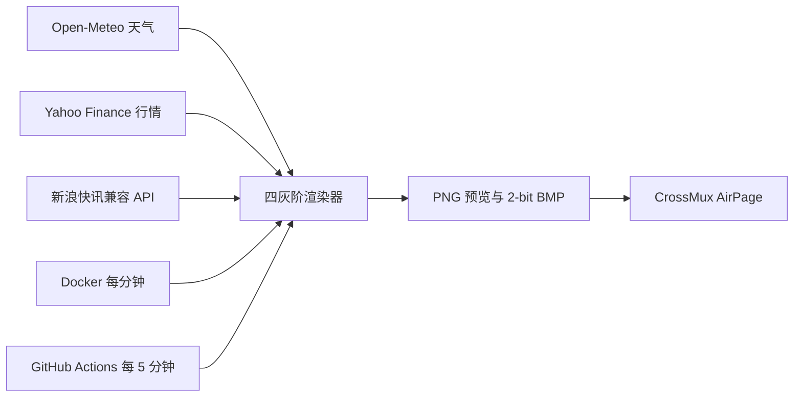

# CrossMux AirPage

面向阅星瞳 X3 / CrossMux AirPage 的四灰阶信息板。它在原生 `528×792`
画布上显示时间与日期、上海 5 日天气、4 条新浪 7×24 快讯，以及上证指数和
两只 A 股自选股，并生成固件可直接接收的 2-bit BMP。

本项目只有定时渲染与推送进程，不提供 Web 页面，也不开放 HTTP 端口。

## 数据流



Docker 和 GitHub Actions 是两种独立运行方式。请只启用一种，避免设备被重复
刷新。当前默认方案是 Docker 每分钟推送；GitHub 定时推送默认关闭。

## Docker 运行

要求 Docker Engine 和 Docker Compose：

```bash
cp .env.example .env
# 在 .env 中填写 AIRPAGE_DEVICE_URL
chmod 600 .env
docker compose up -d --build
```

容器启动后会立即运行一次，之后按照 `AIRPAGE_PUSH_INTERVAL_MINUTES` 周期执行。
生成的 `airpage.png` 和 `airpage.bmp` 保存在 Docker volume 的 `/data`。

常用命令：

```bash
docker compose ps
docker compose logs -f airpage
docker compose up -d --build --force-recreate
docker compose down
```

## GitHub Actions 运行

`.github/workflows/push-airpage.yml` 支持手动运行，也可以在每小时的
`02、07、12……57` 分执行，即约每 5 分钟一次。GitHub 定时任务可能因平台负载
延迟，不是硬实时调度。

启用定时推送需要：

1. 创建 Repository secret `AIRPAGE_DEVICE_URL`。
2. 如需新闻，创建 Repository secret `NEWS_API_BASE_URL`。
3. 创建 Repository variable `AIRPAGE_PUSH_ENABLED=true`。
4. 停止 Docker 推送，避免两套任务同时刷新设备。

天气和行情配置可按下表创建为 Repository variables；未填写时使用项目默认值。
新闻 API 地址始终作为 secret 管理，不应写入代码、文档或普通 variable。

## 环境变量

| 变量 | 默认值 | 用途 |
|---|---:|---|
| `TZ` | `Asia/Shanghai` | 看板时区 |
| `OUTPUT_DIR` | `data` | PNG/BMP 输出目录 |
| `AIRPAGE_WIDTH` / `AIRPAGE_HEIGHT` | `528` / `792` | X3 原生画布尺寸 |
| `WEATHER_LOCATION` | `上海` | 天气标题 |
| `WEATHER_LATITUDE` / `WEATHER_LONGITUDE` | `31.2304` / `121.4737` | Open-Meteo 查询坐标 |
| `WEATHER_TIMEZONE` | `Asia/Shanghai` | 天气时区 |
| `WEATHER_FORECAST_DAYS` | `5` | 显示当天起 1–5 天预报 |
| `MARKET_INDEX_SYMBOL` / `MARKET_INDEX_LABEL` | `000001.SS` / `上证指数` | A 股大盘代码和名称 |
| `STOCK_SYMBOLS` | `601727.SS,600021.SS` | 两只自选股；沪市 `.SS`、深市 `.SZ` |
| `STOCK_LABELS` | `上海电气,上海电力` | 自选股显示名称 |
| `STOCK_RANGE` / `STOCK_INTERVAL` | `5d` / `30m` | 走势图范围与粒度 |
| `NEWS_API_BASE_URL` | 空 | 私有新浪快讯兼容 API；置空可停用，禁止提交到 Git |
| `NEWS_CATEGORY` | `all` | 新闻栏目，支持 `all` 或 `0`–`8` |
| `NEWS_LABEL` | `新浪 · 快讯` | 新闻板块标题 |
| `NEWS_ITEMS` | `4` | 新闻数量，支持 1–4 |
| `AIRPAGE_DEVICE_URL` | 空 | AirPage 完整设备链接，属于凭据 |
| `AIRPAGE_ENABLED` | `true` | 是否允许推送 |
| `AIRPAGE_PUSH_INTERVAL_MINUTES` | `1` | Docker 执行周期，最小 1 分钟 |
| `AIRPAGE_PUSH_ON_START` | `true` | 容器启动后是否立即运行 |
| `AIRPAGE_TRUSTED_HOSTS` | CrossMux 官方域名 | AirPage 目标白名单 |
| `REQUEST_TIMEOUT_SECONDS` | `20` | 外部请求超时 |
| `FONT_SANS_PATH` / `FONT_MONO_PATH` | 自动检测 | 可选字体路径 |

新浪栏目编号：`0` A 股、`1` 宏观、`2` 公司、`3` 数据、`4` 市场、`5` 国际、
`6` 观点、`7` 央行、`8` 其他。

完整模板见 [`.env.example`](.env.example)。

## 本地开发

```bash
python3 -m venv .venv
source .venv/bin/activate
python -m pip install -e ".[test]"

ruff check app tests
ruff format --check app tests
pytest

OUTPUT_DIR=data AIRPAGE_ENABLED=false python -m app.cli --json
docker build -t crossmux-airpage:test .
```

不传 `--push` 时，命令只生成预览和 BMP，不会连接 AirPage 推送接口。

## 自动化工作流

- `ci.yml`：代码规范、测试、X3 原生尺寸冒烟渲染和 Docker 构建。
- `publish.yml`：合并到 `main` 或创建 `v*` 标签后发布 GHCR 镜像。
- `push-airpage.yml`：手动推送；设置 `AIRPAGE_PUSH_ENABLED=true` 后启用
  每 5 分钟定时推送。
- `deploy.yml`：镜像发布成功后更新远程 Docker 主机。自动部署默认关闭；设置
  `DOCKER_DEPLOY_ENABLED=true`，并配置 `DEPLOY_HOST`、`DEPLOY_USER`、
  `DEPLOY_SSH_KEY`、`DEPLOY_KNOWN_HOSTS` secrets 和可选 `DEPLOY_PATH` variable
  后启用。远程目录必须预先保存权限受限的 `.env`。

## 安全约束

- `AIRPAGE_DEVICE_URL` 中的设备 ID 等同上传凭据，只能存放在本地 `.env` 或
  GitHub Actions secret 中。
- `NEWS_API_BASE_URL` 也按凭据处理，不设置公开默认值，只允许存放在本地
  `.env` 或 GitHub Actions secret 中。
- `.env` 已被 Git 和 Docker build context 忽略；建议设置为 `0600` 权限。
- 推送目标仅允许 HTTPS，并限制在 `AIRPAGE_TRUSTED_HOSTS` 白名单。
- 日志只显示掩码后的设备 ID。
- Docker 容器以非 root、只读根文件系统、无 Linux capabilities 运行，只有
  `/data` volume 和 `/tmp` tmpfs 可写。
- 每张 BMP 必须小于 512 KiB；X3 输出约为 102 KiB。

## 许可与参考

项目采用 [MIT License](LICENSE)。AirPage 协议与设备行为参考
[CrossMux](https://github.com/0x1abin/crossmux)。
